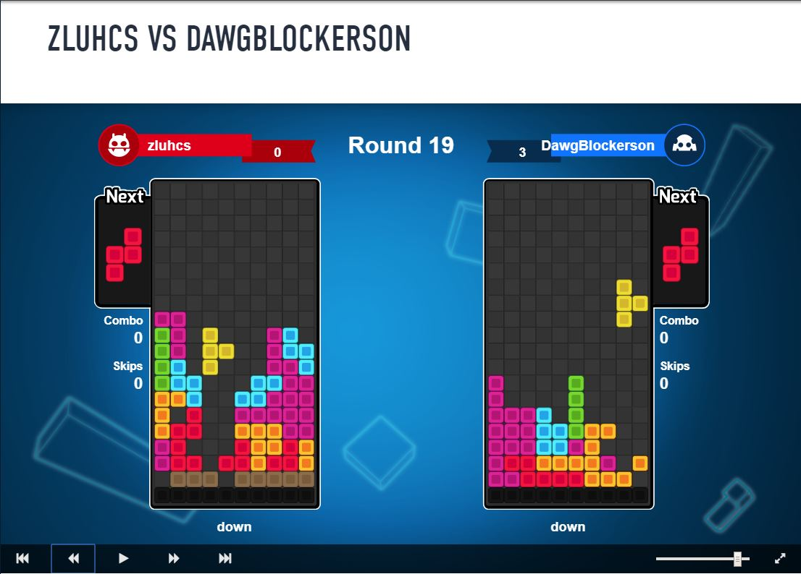

# zluhcs block bot

My AI bot that participated in AI Games Block Battle (http://theaigames.com/competitions/ai-block-battle).

Currently playing non-competitive matches at (https://playground.riddles.io/competitions/ai-block-battle).

Uses search and evaluation, with automatic tuning of evaluation terms.
Basically it is a tetris game, but played against an opponent. Completing lines will send "garbage lines" to the other field. Who lasts longer wins the game.

